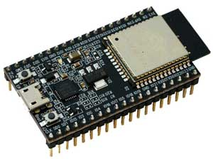
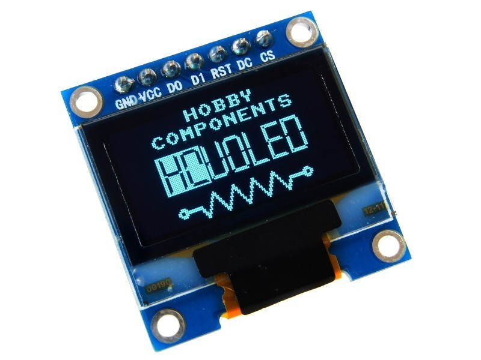
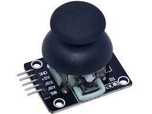
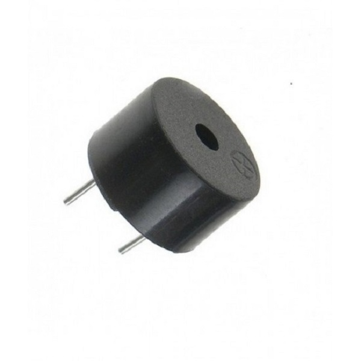
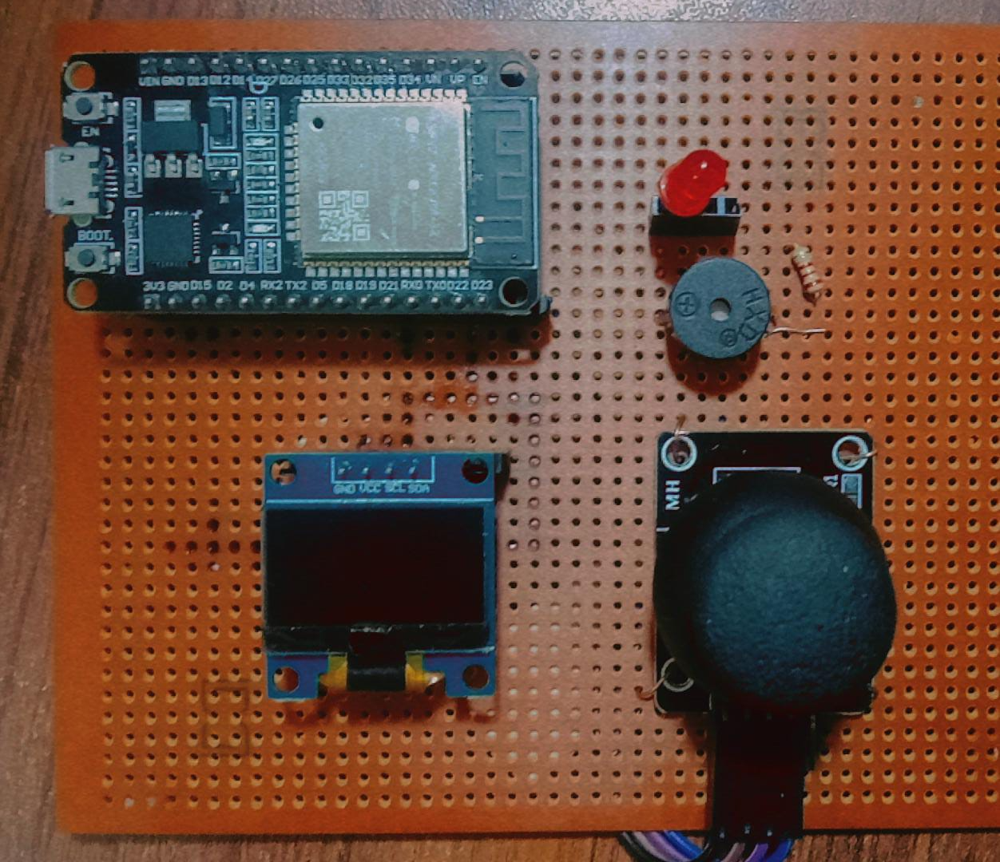

## Arduino Game Console with OLED Display and WiFi Integration
**This project is an Arduino-based game console that allows users to play two classic games: Brick Breaker and Snake. The console uses an OLED display for rendering the games, a joystick for user input, and a buzzer for sound effects. Additionally, it integrates with WiFi to send game scores to ThingSpeak, a cloud-based IoT platform, for tracking and analysis.**

### Features
**Two Games:**

 - Brick Breaker: Break bricks with a paddle and ball.

 - Snake: Control a snake to eat food and grow longer.

**Game Modes:**

- Easy Mode: Slower gameplay for beginners.

- Survival Mode: Faster gameplay for advanced players.

**OLED Display:**

- Renders the game graphics and menus.

- Displays scores and game-over screens.

**Joystick Input:**

- oncontrols movement in both games.

- Navigates menus and selects options.

**Buzzer Feedback:**

- Provides sound effects for scoring, collisions, and game-over events.

**WiFi Integration:**

- Sends game scores to ThingSpeak for remote tracking.

- Uses HTTP GET requests to update the ThingSpeak channel.

**Animations:**

- Start and end animations for a polished user experience.

**ThingSpeak Integration**
The code sends game scores to ThingSpeak using the HTTPClient library.
Scores are sent to different fields based on the game:
- Field 1: Brick Breaker score.
- Field 2: Snake score.

**Hardware Requirements**

Microcontroller: ESP32 (or similar with WiFi capabilities).

Display: SSD1306 OLED (128x64 pixels).

Input: Analog joystick.

Output: Buzzer for sound effects.

**How to Use**

*Upload the Code:*

- Open the code in the Arduino IDE.

- Replace the placeholders for ssid, password, and apiKey with your WiFi credentials and ThingSpeak API key.

- Upload the code to your ESP32.

- Connect the Hardware:

- Connect the OLED display, joystick, and buzzer to the ESP32 as per the pin definitions in the code.

*Play the Games:*

- Use the joystick to navigate the menu and select a game.

- Play Brick Breaker or Snake and try to achieve the highest score.

- View Scores on ThingSpeak:

- Log in to your ThingSpeak account to view the scores sent by the game console.

***Setup***

For demo click on the link below.
https://youtu.be/BajfkyqpX4I